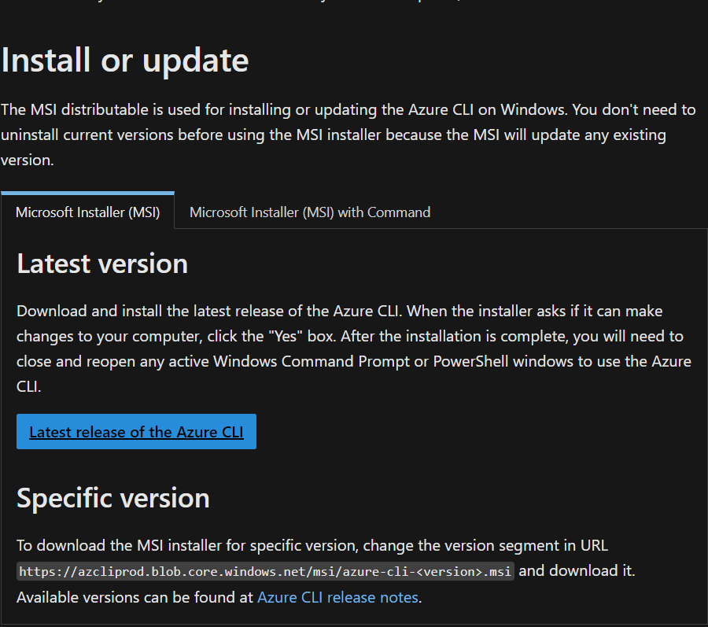
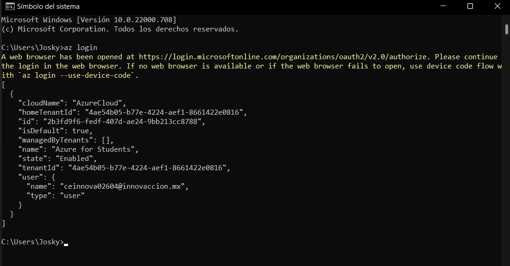
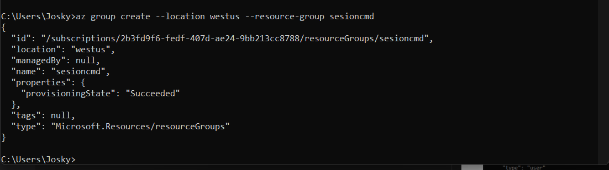
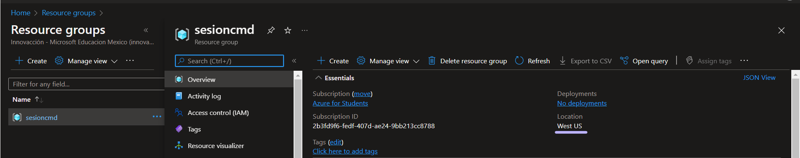

# En este apartado se vera como crear un recurso desde Azure CLI

- Primero debemos descargar [Azure CLI](https://docs.microsoft.com/en-us/cli/azure/install-azure-cli) en en navegador web

Una vez descargado abriremos un centro de comando (cmd) y escribiremos "az login" lo cual nos abrira una pagina para iniciar sesion, una ves iniciado sesion se cerrara la pagina y se mostrara en pantalla del cmd que hemos iniciado correctamente

Ahora para crear un grupo de recursos escribiremos lo siguiente:
"az group create --location (ubicacion) --resource-group (nombre que se desea para el recurso)"

Para terminar regresaremos a la pagina de [Azure](https://portal.azure.com/#home) y buscamos el apartado de recursos para ver que efectivamente se creo nuestro recurso:

